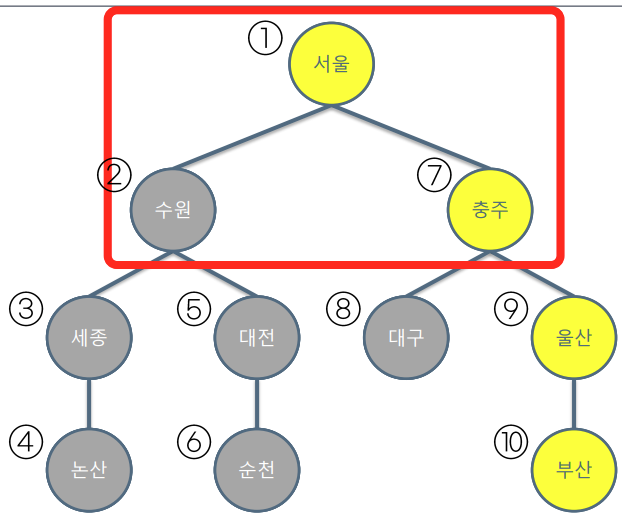
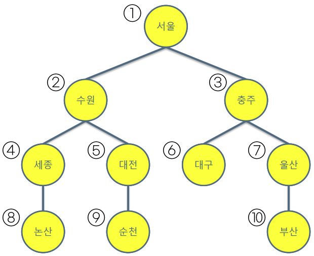

# 1. DFS와 BFS

위 그림은 DFS(Depth First Search, 깊이 우선 탐색)

위 그림은 BFS(Breadth First Search, 너비우선탐색)

---

# 2. DFS - 연결된 요소 찾기 유형이란

- 1번과 연결된 노드의 개수는 몇 개인가요?
- 연결된 묶음/덩어리의 개수는 몇 개인가요?
- 1번과 연결된 노드의 번호를 오름차순으로 출력하세요
- 1번과 3번의 거리는 얼마인가요?

---

## 2.1 이 유형을 잘 풀기 위해 고민할 것들

- 주요 키워드 : 정점, 노드, 간선, 엣지, 연결, 네트워크, 그래프
- 재방문을 방지하는 방법
- 주어진 정보를 어떻게 변환할지 (문제에서는 그림없이 표로만 주어질 수 있음, 아래 표 참고)

| n   | 5   |
| --- | --- |
| m   | 5   |

아래 표는 m개의 간선 정보

| 1   | 4   |
| --- | --- |
| 1   | 2   |
| 2   | 3   |
| 2   | 4   |
| 3   | 4   |
