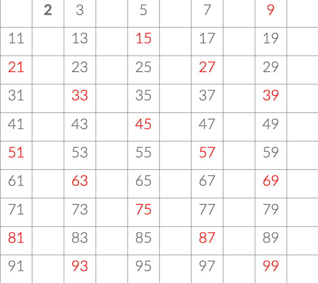
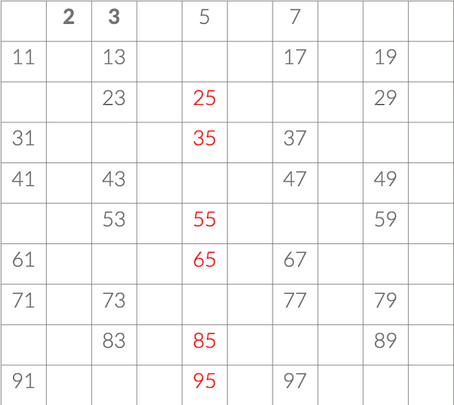
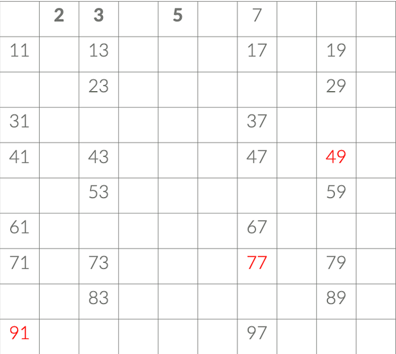
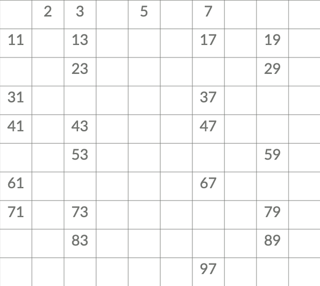

# 1. 소수(Prime Number)

어떤 수 N이 소수인지 아닌지 알아내는데 걸리는 시간 복잡도는 `O(루트N)`이었다.

- N = 백만인 경우 : `루트N = 1,000`
- N = 1억인 경우 : `루트 N = 10,000`

그럼, 1부터 1,000,000까지 모든 소수를 구하는데 걸리는 시간 복잡도는 몇일까?

- 각각의 수에 대해서 소수인지 아닌지 검사해야 한다.
- 각각의 수에 대해서 O(루트N)의 시간이 걸린다.
- 수는 총 N개이기 때문에, `O(N루트N)`이 걸린다.
- 1,000,000 \* 1,000 = 1,000,000,000 = 10억 = 10초
- 너무 긴 시간이 필요하다.

# 2. 에라토스테네스의 체 (Sieve of Eratosthenes)

1부터 N까지 범위 안에 들어가는 모든 소수를 구하려면 에라토스테네스의 체를 사용한다.

1. 2부터 N까지 모든 수를 써놓는다.
2. 아직 지워지지 않은 수 중에서 가장 작은 수를 찾는다.
3. 그 수는 소수이다.
4. 이제 그 수의 배수를 모두 지운다.

---

## 2.1 과정


- 지워지지 않은 수 중에서 가장 작은 수는 2다.
- 2는 소수이고 2의 배수를 모두 지운다



- 3의 배수를 지운다



- 5의 배수를 지운다



- 7의 배수를 지운다



- 11의 배수는 이미 지워져 있다
- 2, 3, 5, 7 로 인해서
- 11 ×11 은 121로 100을 넘기 때문에 더 이상 수행할 필요가 없다
- 남아있는 모든 수가 소수이다

---

## 2.2 코드

```c
int prime[100];   // 소수 저장
int pn = 0;       // 소수의 개수
bool check[101];  // 소수가 아니면 true, 소수면 false
int n = 100;      // 100까지 소수

for (int i = 2; i <= n; i++) {
  if (check[i] == false) {
    prime[pn++] = i;
    for (int j = i * i; j <= n; j += i) {
      check[j] = true;
    }
  }
}
```

- 1부터 N까지 모든 소수를 구하는 것이 목표이기 때문에, 구현할 때는 바깥 for문 (i)를 N까지 돌린다.
- 안쪽 for문 (j)는 N의 크기에 따라서, `i*i` 또는 `i*2`로 바꾸는 것이 좋다.
- i = 백만인 경우 `i*i`는 범위를 넘어가기 때문
