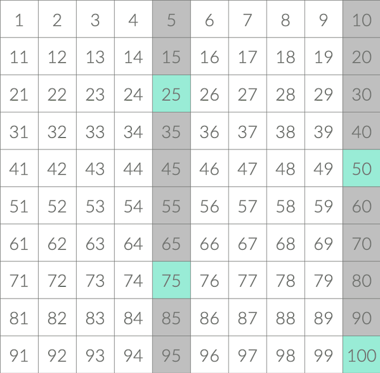
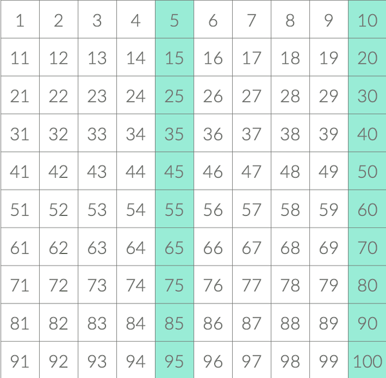
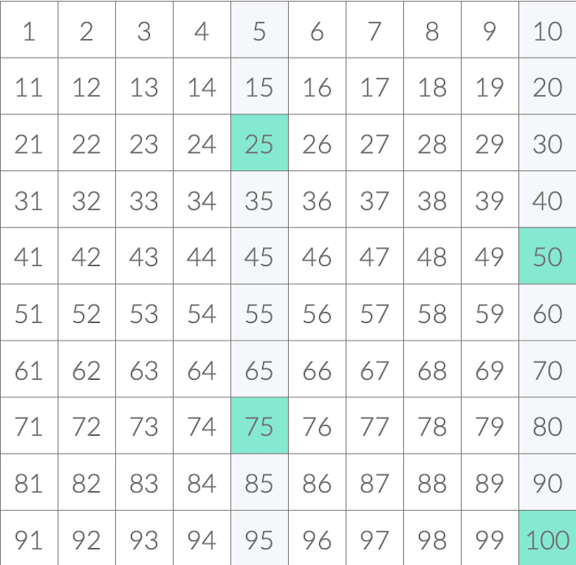

# 1. 팩토리얼 0의 개수

`N! = 1 * 2 * … * N`의 0이 몇 개 인지 알아내는 문제
10! = 3628800
10!이 0이 2개인 이유는 10!을 소인수분해 해보면 알 수 있다

- `10! = 1 * 2 * 3 * 4  * 5 * 6 * 7 * 8 * 9 * 10`
- `10! = 1 * 2 * 3 * 2^2 * 5 * 2 * 3 * 7 * 2^3 * 3^2 * 2 * 5`
- `10! = 2^8 * 3^4 * 5^2 * 7`
- `10! = 2^6 * 3^4 * 7 * (2^2 * 5^2) = 2^6 * 3^4 * 7 * 10^2`
  - 10^2에서 10이 2개 나온 것을 알 수 있다.

0이 몇 개 인지 알아내려면 N!을 소인수분해 했을 때, 2와 5가 몇 개 나오는지 알아야 한다.
5의 개수가 항상 2의 개수 보다 적기 때문에, 5의 개수만 세어주면 된다.

`N! 0의 개수` = `⌊N/5⌋ + ⌊N/5^2⌋ + ⌊N/5^3⌋ + ...`

- 100!의 경우 인수로 5가 들어가는 것을 찾아보자.
- 여기서 25, 50, 75, 100은
- `25*1, 25*2, 25*3, 25*4 = 5*5*1, 5*5*2, 5*5*3, 5*5*4`로
- 5가 각각 2개씩 들어간다.

- 100/5를 했을 때 세는 5의 개수 = 20개
- 25, 50 ,75, 100도 5의 개수를 1개로 센다
- 따라서 100/25를 한 번 더 해서
- 5의 개수를 한 번 더 세어줘야 한다.

- 100/25 = 4 (25, 50, 75, 100)
- 100/5 = 20
- 따라서, 100!의 0의 개수는 20+4 = 24개이다
