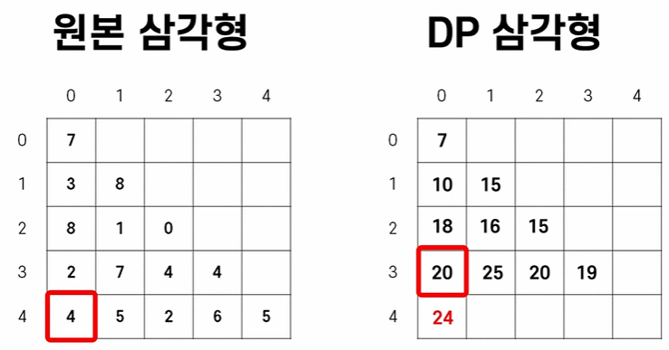

## 1. 브루트포스(완전탐색)

- Brute (단순히, 순전히), Force(힘)
- 단순무식하게 처음부터 다 대입해보는 것
- 구현 방법
  1. for문이 while문으로 구현
  2. 재귀함수
- 문제 : 프로그래머스의 모의고사, 소수찾기

### 4.3 브루트포스(완전탐색) 추천 문제

백준 추천 문제
- 블랙잭 : https://www.acmicpc.net/problem/2798
- 분해합 : https://www.acmicpc.net/problem/2231
- 일곱 난쟁이 : https://www.acmicpc.net/problem/2309

---

## 2. DFS/BFS (그래프 탐색 알고리즘)

- `DFS(Depth First Search)` = 하나를 깊게(깊이 먼저)
  - DFS는 `stack`을 사용
- `BFS(Breadth First Search)` = 여러 개를 하나씩(너비 먼저)
  - BFS는 `queue`를 사용
- `그래프` : 여러 개체들이 연결되어 있는 자료구조
- `탐색` : 특정 개체를 찾기 위한 알고리즘
- 대표적 문제 유형 :
  1. 경로탐색 유형(최단거리, 시간)
  2. 네트워크 유형(연결)
  3. 조합 유형(모든 조합 만들기)
- 문제 : 프로그래머스, 타겟넘버, 네트워크, 단어변환, 여행경로
- 구현 방법
  - `DFS` : 한 놈만 끝가지 패는 유형이라 재귀함수가 가장 일반적
  - `BFS` : 여러 놈을 한대씩 때리면서 가는 유형이라, Queue나 LinkedList가 가장 일반적
- DFS / BFS 중 어떤 걸 써야할까?
  - 결론부터 말하면 DFS를 더 선호
  - 둘 다 탐색을 하는 알고리즘이기에 어떤걸 써도 정답은 나오고, 자신있고 손에 익은 알고리즘을 쓰면 됩니다.
  - 다만 DFS를 더 선호하는 이유는 검증하기 쉬워서 입니다
  - DFS는 어찌됐든 하나의 조합을 완성해서 정답과 비교하고 또 다른 조합을 만들어 보고 정답과 비교하는 식으로 동작하기 때문에 정답을 비교하는 시점에 내가 기대한 대로 조합이 잘 나왔는지 를 확인해 보기가 빠르고 쉽습니다.
  - 그에 비해 비해 BFS는 한 번에 여러 조합들을 한칸 한칸씩 만들다 보니 조합이 완성되어서 정답과 비교하는 시점에 애가 언제 어떻게 만들어졌는지, 어디서부터 틀려먹은건지를 분석하기가 까다롭습니다.
  - 코딩테스틑 시간싸움이다 보니, 짧은 시간 내 알고리즘을 검증해야 하는데, 이걸 위해서는 DFS가 최적이고, 재귀함수만 익혀두면 코드도 훨씬 간결해져서, 버그가 발생할 가능성이 근본적으로 더 작습니다.
- 하지만 BFS도 필요할 떄가 있습니다.
  - DFS가 한 놈만 패는 알고리즘인데, 그 한놈이 너무 오래 걸리면 시간이 초과될 수 있습니다.
  - 다르게 말하면, DFS는 수행 시간 관점에서는 복불복입니다.
  - 운이 좋으면 첫 번쨰 조합이 최적의 답이지만, 최악의 경우에는 모든 조합을 다 만들어 보면서 시간을 낭비하게 됩니다.
  - 그에 비해 BFS는 모든 경우의 수를 한 걸음씩 나가기 때문에 초반에는 느려보일 수 있지만, 하나의 정답만 찾고나면, 나머지 경우의 수는 정답에서 제외합니다.
  - 쉽게 말해, BFS는 대박날 확률도 적지만, 쪽박 찰 확률도 적습니다.
  - CS적으로 말해보면, 시간복잡도가 낮습니다.
- 코테의 경우
  - 앞쪽에 쉬운 문제로 나왔다면 빠르게 DFS로 푸는 것을 추천하고,
  - 뒤쪽에 어려운 문제로 보이거나, DFS로 풀기 너무 오래 걸릴 거 같으면, BFS로 풉니다.

---

## 3. Hash

- Key: Value형태의 자료구조 (e.g. 전화번호부)
- 검색창에 이름을 입력하면, 전화번호 결과가 나온다.
  - 여기서 이름 = Key, 전화번호 = Value
  - 무언가 찾기 위한 검색어 = Key, 그 검색어로 나온 결과 = Value
- Hash는 배열과 달리 String 타입이나 다른 어떤 데이터형을 기반으로 자료구조를 접근하고, 데이터를 관리해줌
- Hash에는 여러 특징이 있지만, 코테를 위한 이해할 딱 1가지는 `Hash는 모든 데이터 타입으로 접근이 가능하다`입니다.
- 문제 : 프로그래머스 완주하지 못한 선수
  - Hash를 사용하면 간단하게 해결가능하다
  - `HashMap.put(“A”, true)`로 입력하면, `HashMap[“A”] = true`와 같습니다.
  - 그리고 이 값을 읽어오고 싶을 떄는,
  - `bool fin = hashmap.get(“A”)` 또는 `bool fin = hashmap[“A”]`
- `getOrDefault(“A”, false)` : A가 있다면, A의 Value를 반환, A가 없다면, false를 반환해주는 함수
- `get / put / getOrDefault` 함수 3개를 알면 해시 문제는 대부분 해결 가능
- 어떤 문제에서 Hash를 써야할까?
  - String을 기반으로 정보를 기록하고 관리해야 될 떄 Hash
- 첫 번쨰 예시로 완주하지 못한 선수 문제는 선수이름이 완주여부이고,
  - String이니 Hash를 써야겠다는 생각이 떠올라야 합니다.
  - `String Key : bool Value`라는 HashMap을 구하면 문제를 쉽게 해결할 수 있습니다.
- 두 번쨰로 게시판 사용자 문제의 경우
  - 신고당한 사람을 기준으로, 신고자들의 목록을 관리해야 합니다.
  - 여기서도 신고당한 사람의 이름이 String이니 Hash를 써야겠다고 판단할 수 있고,
  - `String Key`와 `ArrayList<String> Value`를 사용해서 신고자의 목록을 관리하면 됩니다.
- 마지막으로 위장 문제의 경우
  - 옷의 종류에 따라 몇 개의 옵션이 있는지 세야 합니다.
  - 옷의 종류가 정수가 아니라 `얼굴/상의/하의/겉옷`과 같이 String입니다.
  - `String Key : Integer Value`라는 HashMap을 구하면 문제를 쉽게 해결할 수 있습니다
- 결론은 String을 기준으로 정보를 기록하고 관리하려면, 단순 배열을 쓸 수 없으니 Hash를 활용하자.
  - Hash = 전화번호부
  - 대부분 key가 String이다.
  - put / get / getOrDefault 3개 함수만 기억하자

---

### 3.1 Hash 추천 문제

백준 추천 문제
- 실버 4
  - 숫자 카드 (10816) : https://www.acmicpc.net/problem/10816
  - 듣보잡 (1764) : https://www.acmicpc.net/problem/1764
- 나는야 포켓몬 마스터 이다솜 (1620) : https://www.acmicpc.net/problem/1620
- 패션왕 신해빈 (9375) : https://www.acmicpc.net/problem/9375

---

## 4. 문자열(String)

### 4.1 문자열 단순 구현 유형

- 별다른 알고리즘이 필요하지 않고, 문제에서 여러 단계에 걸친 동작을 설명해주면, 그대로만 잘 구현하면 되는 문제
- 대표문제 : 카카오 기출의 신규아이디 추천
  - 7단계에 걸쳐서 사용자가 만들려고 하는 아이디를 규치겡 따라 수정하여 새로운 아이디를 추천
  - 대문자를 소문자로 치환하고, 허용하지 않는 문자들을 제거하고 등의 아주 간단한 동작만 수행하면 돼서
  - 이런 문제들은 기본적은 String 관련 함수들만 잘 정리해 뒀다가 시험 전에 복습용으로 1번 쓱 보면 됩니다.
- `equals, length, toUpperCase, toLowerCase`의 기본 4가지 함수
- `indexOf` : 있으면 시작인덱스 위치를 반환, 없으면 -1 반환
  - 문자열 내 다른 문자열이 존재하는지 판단할 떄 사용
- `substring` : string의 일부를 추출할 떄 사용
  - `“Hello”.substring(1, 3) => “el”`
- `replace` : 문자열의 일부를 찾아서 대체하는 함수
  - `“Hello”.replace(“l”, “”) => “He  o”`
- `trim` : 앞뒤 공백을 제거하는 함수
  - `“ Hello ”.trim()) => “Hello”`
- `compareTo` : 두 문자열의 ASCII 순서 비교, 즉 알파벳 순서 비교하는 함수
  - `“a”.compareTo("b")) => (-)`
  - `“a”.compareTo("a")) => 0`
  - `“b”.compareTo("a")) => (+)`
  - 주의할 점은 대문자와 소문자는 각각 다른 아스키 값을 갖기 떄문에 다릅니다.
- 이외에도 `split, contains, charAt, startsWith, endsWith`는 문제풀이하면서 자연스럽게 외웠다면 코테칠 떄, 쓰면 됨
  - 이외라고 적은 함수들은 자주 쓰고 완전히 익혀두지 않으면 시험환경에서 떠올리고 사용하기 힘들다.
  - 위에 필수적인 함수들만 알고있으면, 응용해서 구현이 가능하다.

---

### 4.2 문자열 + 기타 알고리즘 유형

- 첫 번쨰 문자열 단순 구현 + Hash, 정렬, DFS 등의 알고리즘을 접목해야 풀 수 있는 문제
- 대표문제 : 카카오 2022년 신고결과 받기
  - 문자열 parsing => indexOf + substring만 사용해서 풀 수 없고, Hash을 같이 접목해야만 풀 수 있다.
- 두 번쨰 유형의 문제들이 더 많이 출제되는 추세이다.
- 이 유형은 문자열이 첨가된 사실상 알고리즘을 쓸 줄 아는지 물어보는 문제라서,
  - 알고리즘과 자료구조에 대해서 준비할 필요가 있다.

> 💡 문자열 1번 유형의 경우 네카라 1번 문제 문자열로 자주 출제된다.
>
> 문제를 푸는데 어려움이 없고, 관련 함수들을 구글링없이 잘 사용했다면, 충분히 실력을 갖췄다고 판단해도 된다.
> 2번 유형은 다른 알고리즘을 익히는게 더 중요하다.

---

### 4.3 문자열 추천 문제

백준 추천 문제
- 숫자의 합 (11720) : https://www.acmicpc.net/problem/11720
- 단어 공부 (1157) : https://www.acmicpc.net/problem/1157

프로그래머스 추천 문제
- 문자열 밀기 : https://school.programmers.co.kr/learn/courses/30/lessons/120921
- 옹알이 (1) : https://school.programmers.co.kr/learn/courses/30/lessons/120956

---

## 5. DP(Dynamic Programing)

- `큰 문제를 작은 문제로 나눠서 푸는 알고리즘`
  - Dynamic Programming의 다이나믹은 **아무 의미가 없다**.
  - 이 용어를 처음 사용한 1940년 Richard Bellman은 **멋있어 보여서 사용했다고 한다**
- DP는 완전탐색, DFS, BFS와 같이 수 많은 경우의 수를 따져보는데, 그 경우의 수가 너무 많아서 속도가 느려지는 문제를 개선하고자 나온 알고리즘입니다.
- DP가 없던 시절에는 최단경로 찾기나 최고점수를 만드는 문제를 풀려면,
  - 모든 조합을 다 만들어 보는 수 밖에 없었습니다.
  - DP가 나온 이후에는 수행시간을 현저히 줄일 수 있었습니다.
- 문제 : 프로그래머스, 정수 삼각형
  - https://school.programmers.co.kr/learn/courses/30/lessons/43105
  - 삼각형의 숫자들이 주어지고, 윗 곡지점에서 시작해서 왼쪽이나 오른쪽 대각선으로만 이동할 수 있다고 할 떄,
  - 가장 높은 점수를 만들 수 있는 값이 얼마인지를 찾는 문제
- DP가 없었다면, DFS를 사용해 
  - 7-3-8-2-4를 더해서 24를 구해서 max 변수를 갱신하고, 
  - 그 다음 7-3-8-2-5를 더해서 25를 구해서 max 변수를 갱신하고
  - 그 다음 7-3-8-7-5를 더해서 30를 구해서 max 변수를 갱신하고
  - 이 동작을 반복해서 모든 경우의 수를 따져보면, 30이 최대값입니다.
  - 5줄짜리 삼각형이면 DFS로 풀어도 문제없지만,
  - 제한사항대로 500줄 삼각형이면 경우의 수가 너무 많아집니다.
  - 또 많은 조합을 보면 중복적인 연산이 많습니다.

위 문제를 DP로 풀어본다면,
  - 컴퓨터는 대각선을 이해하지 못하니 직각삼각형 형태로 바꿔보면,
  - 내 밑으로 가거나, 내 밑의 오른쪽으로 가거나 2가지 경우 입니다.
  - 각 경우의 수마다 나올 수 있는 최대값을 담을 2차원 배열(DP 삼각형)을 만듭니다.
  - 그리고 각 경우의 수에서 최대값이 나오면 해당 위치를 갱신합니다.
  - 자세히 보면 1번 줄에서 2번줄로 내려올 떄, 0번 줄은 고려하지 않았습니다.
    - 왜냐하면 1번 줄까지 올 수 있는 최적값에는 이전의 모든 조합 중 최고값만을 남겨놨기 때문에,
    - 이전에 정보를 볼 필요가 없는 것이죠.
    - 그러면 3번줄 계산할 떄도 2번줄만 보면 됩니다.

--- 

### 5.1  DP의 사용 목적

- 메모리를 사용해서 중복 연산을 줄이고, 중복 연산을 줄여서 수행 속도를 개선한다.
  - `메모리를 사용한다` === 또 하나의 배열 혹은 자료구조를 만든다
  - `이를 통해 중복 연산을 줄인다` === 연산 결과를 배열에 담아서 반복연산을 안한다
- 왜 이걸 DP라고 하는 건가요?
  - 어떤 한 교수는 `기억하며 풀기 알고리즘`라고 번역했는데,
  - 이게 더 직관적인 이름이다.
  - DP란 용어를 처음 사용한 Richard Bellman은 **멋있어 보여서 사용했다고 한다**
- 즉, 연산한 값을 기억하고, 다음에도 그 연산이 필요할 떄, 
  - 기억해 놓은 값을 사용해서 문제를 푸는 게 DP의 전부입니다. 

--- 

### 5.2  DP 문제인지 구분하는 법

- DP 유형은 특정 유형에만 국한되지 않고,
  - 다양한 문제를 최적화할 떄 고려할 수 있는 알고리즘입니다.
- 코테나 문제를 보고 DP로 풀어야 겠다는 기준을 2가지로 정리할 수 있습니다.
  - 기준1. DFS/BFS로 풀 수는 있지만, 경우의 수가 너무 많은 문제
    - e.g. 정수 삼각형 5줄이면 그냥 DFS로 풀어도 되지만, 수 백줄이면 DP 사용
    - 이런 문제의 최악의 경우의 수를 계산하는 가장 쉬운 방법은 `직접 계산하기` 입니다.
    - 정수 삼각형 문제의 경우 한 줄짜리 삼각혀우터 경우의 수를 계산해서,
    - 패턴이 보일 떄까지 반복합니다.
    - 1줄이면 1개, 2줄이면 2개, 3줄이면 4개, 4줄이면 8개
    - 보면 1로 시작해서 2배씩 증가하는 것을 볼 수 있습니다.
    - 수학적으로 정리하면 2^(n-1)입니다.
    - 문제의 최대 수는 500이고 최악의 경우의 수는 2^(499)가 됩니다.
    - DFS나 완전탐색으로 풀 수 있는 마지노선은 500만 정도입니다. (5 * 10^6)
  - 기준2. 경우의 수들에 중복 연산이 많은 경우
    - DFS로 풀었다면, 모든 조합을 매번 해봤을 겁니다.
    - 그런데 이미 최대값이 될 수 없는 조합도 계속 연산해 시간낭비되고 있습니다.
    - 이걸 줄이고자 각 위치가지 올 수 있는 최적의 값만 남겨놓고,
      - 나머지 조합은 다 버렸습니다.
    - 이렇게 하면 안될 조합들은 미리미리 버려서 가장 좋은 조합끼리만 다시 비교하고, 
      - 그 중 가장 좋은 조합을 또 추려내는 식으로 반복해 문제를 풉니다.

--- 

### 5.3 DP 문제 해결 접근 방법

- DP로 풀어야 겠다고 판단이 서면,
  - 최대한 많은 문제들을 풀어보고 풀이들을 참고하면서
  - DP식 사고방식을 습득하기
- 오래 붙잡고 있기 보다는 30분 고민해보고 답이 안나오면,
  - `풀이를 참고해서 구현만 해보는 방식을 추천`
  - 그 30분동안에는 어떻게 하면, 뒤로 돌아가지 않을까 고민해야 합니다.
  - 즉, 현재 단계까지 연산을 잘했는데, 
    - 그 연산을 또 하지 않으려면 어떤 정보를 남겨야 할지,
    - 어떤 식으로 정보를 누적해야 될지를 고민해야 합니다.
- DP 삼각형과 같이 나만의 자료구조를 하나 더 만들고, 
  - 거기에 어떤 정보를 담아야 이전 단계로 돌아가지 않을 지 고민해보는 겁니다.
- DP 알고리즘은 Queue나 Stack처럼 정형화된 알고리즘이 아닙니다.
  - 일반 개발자가 구현한 Queue나 천재 개발자가 구현한 Queue나 똑같습니다.
  - 다만 DP는 완전히 다를 수 있습니다.
  - DP는 정해진 자료구조를 구현하는 하나의 자료구조가 아니라,
  - 수행 시간을 단축할 수 있는 기법이기 때문에,
  - 그 기법을 구현할 방법은 끝도 없이 많습니다.
  - 그러니 문제, 풀이를 많이 풀고, 봐야 합니다.

--- 

### 5.4 추천 문제

- 추천 문제
  - 피보나치 수5 (10870) (https://www.acmicpc.net/problem/10870)
  - 피보나치 수 (2747) (https://www.acmicpc.net/problem/2747)
  - 전구 (2449) (https://www.acmicpc.net/problem/2449)

---

## 6. Greedy(그리디, 탐욕)

- `미래를 고려하지 않고, 오직 현재 시점에 가장 좋은 선택을 하는 알고리즘`
- 즉, 내가 내린 선택이 나중에 어떤 결과를 나올지는 고려하지 않고,
  - 무조건 지금 가장 저렴한 선택, 가장 빠른 선택, 혹은 가장 가치있는 선택을 내리고
  - 뒤도 돌아보지 않는 겁니다.
  - e.g. 마치 상남자처럼...
- 문제 : 동전 0 (백준 11047) - https://www.acmicpc.net/problem/11047
  - 가장 큰 동전부터 최대한 많이 소진하고, 뒤에 있는 동전은 상관하지 않는다
- 주요 특징
  - 항상 최적의 해를 보장하지는 않는다.
    - e.g. 마시멜로 이야기(10분뒤에 2배씩 증가)같은 경우
    - 그리디 알고리즘은 당장 먹는게 좋다고 판단해버림
    - 즉, 현재의 최적해가 항상 전체의 최적화가 되는 것은 아님
    - 때문에 그리디 알고리즘을 근사 알고리즘이라고도 부름
- 따라서 최적의 해를 보장하는 조건에서만 그리디를 사용해야 함
  - 조건1. 현재의 선택이 미래의 선택에 영향을 주지 않는다.
    - e.g. 서울 -> 대전 -> 부산을 갈 떄 최소비용을 계산하는 경우
    - 대전으로만 가는 비용만 따져서 선택
    - 대전에 도착 한뒤에는 부산으로 가는 비용만 선택
    - 이를 `탐욕스런 선택 조건(Greedy Choice Property)`이라고도 부름
  - 조건2. 부분의 최적해가 모이면 전체의 최적해가 된다.
    - e.g. 서울 -> 대전 -> 부산을 갈 떄 최소 거리을 계산하는 경우
    - `서울 -> 대전의 최소 거리` + `대전 -> 부산의 최소거리`가 정답
    - 즉, 하나의 큰 문제를 여러 개의 작은 문제들로 나눌 수 있고,
    - 그 작은 문제들의 최적의 해가 더해진 것이 전체 문제의 최적해가 됨
    - 이를 `최적 부분 구조 조건(Optimal Substructure)`이라고도 부름

위 두 조건이 성립되어야만 그리디 알고리즘이 근사값이 아닌 최적의 값을 보장할 수 있습니다.

--- 

### 6.1 그리디 전략

위 두 조건을 가지고 어떻게 문제를 풀어야 할까요? 핵심은 정렬입니다.

- 어떻게 정렬해야 두 조건을 만족할까요?
- 다른 말로, 어떻게 정렬해야 미래의 선택은 따져보지 않고, 현재만 고려해도 최적해를 구할 수 있을까요?
- 문제 : 회의실 배정(백준 1931)
  - https://www.acmicpc.net/problem/1931
  - 하나의 회의실을 사용하고자 하는 n개의 사용 요청을 받습니다.
  - 각 요청은 회의 시작시간, 종료시간 정보를 제공하는데,
  - 겹치지 않는 회의를 최대한 많이 진행한다면, 몇 개가지 진행할 수 있는지 묻는 문제
  - 핵심은 회의가 언제 끝나느냐가 중요하다.
  - 즉, **가장 빨리 끝나는 회의부터 먼저 진행해야 가장 많은 회의를 진행**할 수 있다.
  - 그러므로 입력받은 정보들을 종료시간 기준으로 오름차순 정렬한 뒤
  - 제일 처음부터 진행가능한 회의들을 하나씩 진행합니다.
  - 그렇게 하나를 진행하고 나면, 
  - 해당 종료 시간 전에 시작하는 회의는 진행이 불가능하니 무시하고,
  - 진행 가능한 회의들을 또 진행하며 반복하면 정답입니다.

--- 

### 6.2 왜 쓰냐?

- 이 유형은 정렬을 잘해서 빠르게 문제 풀기가 핵심이다.
- 그래서 문제마다 비슷한 구석을 찾기도 쉽지 않다.
- 반대로 말하면, 문제를 많이 풀어야 잘 풀 수 있다.
- 이걸 코테에서 쓰는 이유는 속도때문입니다.
  - 그리디는 사실 DP의 사촌동생같은 존재로 DP보다 더 빠릅니다.
  - 완전탐색이 가장 단순 무식하게 정답을 찾는 방식이였는데,
- 이게 너무 느리다보니 개선하고자 DP라는 알고리즘을 사용하게 됐는데,
  - DP도 항상 최적화를 보장하기 위해서 모든 경우의 수를 고려합니다.
  - 근데, 그러다 보니 느려지는 겁니다.
- 그래서 100% 최적화를 보장하지 않는 경우 대해서 그리디 알고리즘이 만들어진겁니다.
- 그리고 우리는 코테를 위해 최적화가 보장되는 경우에만 그리디를 씁니다.
- 현실 세게에서는 완벽한 정답이 아닌 근사치 정도만 나와도 만족스러운 경우
  - 성능 개선을 위해서 그리디를 사용합니다.
  - e.g. 네비로 길 안내는 받는데, 전국 모든 도로를 비교해 최단시간를 찾으면,
  - 오래 걸려서 속 터집니다.
  - 길 안내는 10분 내로 차이가 난다면 큰 문제없고 견딜만 하죠.
  - 적당한 해답을 빠른 시간 내 얻을 수 있다면 사용자도 좋아하겠죠.
- 이와 같이 근사치로 만족할 수 있는 것에는 성능 개선을 위해 사용되곤 합니다.

--- 

### 6.3 추천 문제

- 백준 브론즈
  - 세탁소 사장 동혁(2720)
  - 전자레인지(10162)
  - 거스름돈(5585)
  - 캠핑(4796)
  - 컵홀더(2810)
- 백준 실버
  - 설탕배달(2839)
  - ATM(11399)
  - 동전 0(11047)
  - 잃어버린 괄호(1541)
  - 회의실 배정(1931)
- 백준 골드
  - 강의실 배정(11000)
  - 카드 정렬하기(1715)
  - 단어 수학(1339)
  - 수 묶기(1744)
  - 보석 도둑(1202)

https://aiday.tistory.com/60