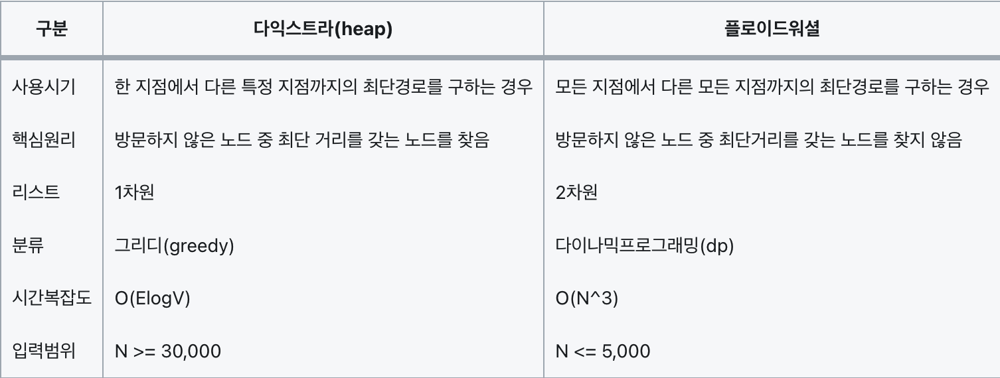

## 1. 다익스트라 vs 플로이드 워셜



다익스트라   : 한 지점에서 다른 특정 지점까지의 최단 경로를 구하는 경우
플로이드 워셜 : 모든 지점에서 다른 모든 지점까지의 최단 경로를 모두 구하는 경우

예를 들어, 2번 노드의 점화식을 구할 때 대각선과 2행 2열의 값은 구하지 않아도 된다.
즉, [1, 2, 3, 4]의 노드 중 2를 제외한 나머지 [1, 3, 4]노드 중 2개의 노드를 뽑는 경우
[1, 3], [1, 4], [3, 1], [3, 4], [4, 1], [4, 3]의 경우의 수만 구하면 된다.
나머지 노드의 경우의 수를 구할때도 동일하다.

다음 코드는 3개의 data 중 2개를 뽑는 경우의 수를 출력한 코드이다.
만약, 다음으로 어떤 항을 구해야하는지 헷갈린다면 참고해서 사용하자.

```python
import itertools

data = [1, 3, 4]

for i in itertools.permutations(data, 2):
    print(list(i), end=" ")
# 👉🏽 [1, 3] [1, 4] [3, 1] [3, 4] [4, 1] [4, 3]

# ---- 플로이드 워셜의 점화식
# D(ab) = min(D(ab), D(ak) + D(kb))
```
